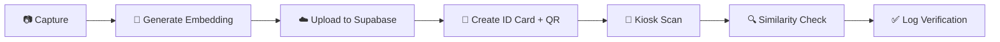

<div align="center">


<br/>

[](https://github.com/Arshath015)
&nbsp;
&nbsp;
&nbsp;
&nbsp;
&nbsp;

</div>

---

## Project Description

**Identity Verification Platform** is an end-to-end biometric identity system built around three coordinated services: a kiosk-grade Streamlit app for live capture and verification, a cloud companion for APIs and background processing, and a dedicated training pipeline for face-embedding similarity models.

The platform handles the full identity lifecycle - **register a person → generate a QR-linked ID → verify them later via live face match against a Supabase-backed knowledge base** - with every step logged for audit. It's designed to be modular and resilient: each service (camera, biometrics, QR, email, database) is isolated, defensive fallbacks keep the kiosk running even without GPU/TensorFlow or live network access, and the training module lets you tune match thresholds against your own dataset before deploying.

> Built for research, demo, and PoC deployments - not a hardened production identity system out of the box.

---

## Table of Contents

- [Project Description](#-project-description)
- [Overview](#-overview)
- [System Architecture](#-system-architecture)
- [About the Author](#-about-project-owner)
- [Tech Stack](#-tech-stack)
- [Repository Structure](#-repository-structure)
- [How It Works](#-how-it-works)
- [Module Breakdown](#-module-breakdown)
- [Model Training & Evaluation](#-model-training--evaluation)
- [Supabase Schema & SQL](#-supabase-schema--sql)
- [Optional Visual Extra - 3D Block Animation](#-optional-visual-extra--3d-block-animation)
- [Running Locally](#-running-locally)
- [Deployment Notes](#-deployment-notes)
- [Troubleshooting & FAQ](#-troubleshooting--faq)
- [Visual Tour](#-visual-tour)
- [Credits & License](#-credits--license)

---

## Overview

This repository groups three coordinated projects focused on identity capture, biometric verification, and embedding-based similarity training:

<div align="center">

| 🖥️ Module | ⚙️ Purpose | 🔑 Core Tech |
|:---|:---|:---|
| **`ai_native_app/`** | On-device kiosk + admin dashboard - camera, QR, biometric capture, Supabase storage/DB | Streamlit, OpenCV |
| **`cloud_native_app/`** | Cloud companion for APIs, webhook ingestion, background tasks | Python, REST |
| **`face_similarity_training/`** | Dataset preprocessing, embedding generation, threshold analysis | NumPy, DeepFace |

</div>

The repository is built for research, demo, and PoC deployments, with a clear separation between UI logic and services (Supabase, biometric, QR, email), and training code isolated for reuse.

---

## System Architecture

<div align="center">

<br/><sub><b>High-level architecture</b> - kiosk, cloud companion, and Supabase backend</sub>
<br/><br/>

<br/><sub><b>Service-level architecture</b> - how individual services communicate</sub>
</div>

### Data Flow

<div align="center">

<br/><sub>End-to-end data flow: capture → embed → store → match → log</sub>
</div>

### Algorithm Flow

<div align="center">

<br/><sub>Face matching algorithm - from frame capture to similarity decision</sub>
</div>

---

## About (Project Owner)

```python
class Owner:
    NAME = "Arshath Farwyz"
    ROLE = "AI Creative Engineer"
    LOCATION = "Chennai / Bangalore, India"
    CORE_STACK = ["Python", "Streamlit", "Supabase", "OpenCV", "FastAPI", "LangChain"]

    def motto(self):
        return "Automate the repetitive. Amplify the creative. Engineer the impossible."

owner = Owner()
print(owner.motto())
```

---

## Tech Stack

<div align="center">


</div>

- **Languages:** Python, SQL
- **UI:** Streamlit
- **Vision:** OpenCV (fallback), optional DeepFace / TensorFlow for stronger embeddings
- **Database & Storage:** Supabase (Postgres + Storage)
- **Packaging:** virtualenv / pip

---

## Repository Structure

```
ai_native_app/
├── app.py                  # Entry point (Streamlit router)
├── config.py                # Environment configuration
├── pages/                   # register, dashboard, kiosk
└── services/                 # supabase, biometric, qr, email, knowledge base
└── ui/                       # theme + UI helpers

cloud_native_app/
└── app.py                   # Cloud-facing API / webhook / background-task entry point

face_similarity_training/
├── scripts/                  # preprocessing, embedding generation, threshold analysis
├── models/                   # saved model artifacts
├── train_embeddings.npy      # sample/trained embeddings
└── results/                  # similarity score CSVs and analysis output
```

---

## How It Works

<div align="center">



</div>

1. **Registration flow** - camera capture → optional face embedding → upload to the `id_photos` bucket → create an `id_cards` entry.
2. **Kiosk flow** - QR scan / ID lookup → live face capture → embedding → cosine similarity check against the knowledge base → record in `verifications`.
3. **Training** - use `face_similarity_training/scripts` to build embeddings and tune thresholds (outputs saved to `results/`).

---

## Module Breakdown

### `ai_native_app/`

- **`app.py`** - lightweight router that applies the UI theme and mounts three tabs: Register Person, Command Center, Auto-Scan Kiosk.
- **`config.py`** - loads environment variables (optional `python-dotenv` support); exposes `SUPABASE_URL`, `SUPABASE_KEY`, `STORAGE_BUCKET`, `MODEL_NAME`, `VERIFICATION_THRESHOLD`.
- **`ui/theme.py`** - CSS for the cyber/JARVIS-style look, plus `render_terminal_logs()` used by the kiosk and dashboard.
- **`pages/register_page.py`** - handles biometric capture via `st.camera_input`, registration form validation, photo upload to Supabase storage, and QR generation + email dispatch.
- **`pages/dashboard_page.py`** - admin view with user listing, search, inline edits/deletes, and verification logs.
- **`pages/kiosk_page.py`** - continuous camera loop: QR scan → map UUID to known user via the embeddings knowledge base → face detection + embedding → similarity check → record verification. Includes recovery handling for camera hardware locks and frame-rate throttling.
- **`services/supabase_service.py`** - single source of truth for Supabase client init and table/storage methods; defensive fallbacks when credentials or network are missing.
- **`services/biometric_service.py`** - `BiometricEngine.extract_and_embed()` returns a normalized embedding vector and bounding box. Uses a lightweight OpenCV fallback when the TensorFlow-based DeepFace stack isn't available, and switches to DeepFace automatically when present.
- **`services/qr_service.py`, `email_service.py`, `knowledge_service.py`** - QR encode/decode, email dispatch with attachments, and the in-memory knowledge base (ID → embedding map).

> **Tip:** keep `.env` secrets out of source control. If your environment can't install heavy ML packages, the app gracefully falls back to the lightweight OpenCV embedding.

### `cloud_native_app/`

A separate cloud-oriented entry point. Typical responsibilities include:

- Exposing webhooks/REST endpoints to integrate with the Streamlit kiosk (remote logging, centralized verification replicas, admin automation).
- Running background tasks (scheduled model refreshes, batch embedding ingestion).

For production: wrap the app behind authentication, use environment variables for secrets, and deploy on a platform that supports long-running processes (Azure App Service, AWS ECS, GCP Cloud Run).

### `face_similarity_training/`

- **`scripts/preprocess_faces.py`** - face cropping, alignment, dataset prep.
- **`scripts/generate_embeddings.py`** - generates embeddings and saves them (e.g. `train_embeddings.npy`).
- **`scripts/threshold_analysis.py`** - pairwise comparisons, ROC curve computation, writes `similarity_scores.csv` to `results/`.

> Keep training datasets separate and respect privacy rules when handling biometric data.

---

## Model Training & Evaluation

<div align="center">

<table>
<tr>
<td align="center" width="33%">

<br/><b>Dataset Acquisition</b>
</td>
<td align="center" width="33%">

<br/><b>Preprocessing</b>
</td>
<td align="center" width="33%">

<br/><b>Model Weights</b>
</td>
</tr>
</table>


<br/><sub><b>Threshold analysis</b> - similarity score distribution used to tune the verification threshold</sub>

</div>

---

## Supabase Schema & SQL

<div align="center">

<br/><sub>Live schema as configured in Supabase</sub>
</div>

Run this in the Supabase SQL editor to create the schema used by both apps.

```sql
-- Enable UUID extension
CREATE EXTENSION IF NOT EXISTS "pgcrypto";

-- Users / ID Cards
CREATE TABLE IF NOT EXISTS id_cards (
  id uuid PRIMARY KEY DEFAULT gen_random_uuid(),
  full_name text NOT NULL,
  rrn text UNIQUE,
  department text,
  phone text,
  email text UNIQUE,
  photo_path text,
  is_active boolean DEFAULT true,
  created_at timestamptz DEFAULT now(),
  updated_at timestamptz
);

-- Verifications
CREATE TABLE IF NOT EXISTS verifications (
  id uuid PRIMARY KEY DEFAULT gen_random_uuid(),
  card_id uuid REFERENCES id_cards(id) ON DELETE SET NULL,
  result text NOT NULL,
  note text,
  created_at timestamptz DEFAULT now()
);

-- Indexes
CREATE INDEX IF NOT EXISTS idx_id_cards_email ON id_cards(email);
CREATE INDEX IF NOT EXISTS idx_verifications_card_id ON verifications(card_id);

-- Example seed data
INSERT INTO id_cards(full_name, rrn, department, phone, email, photo_path)
VALUES ('Alice Example','RRN-001','Engineering','+1234567890','alice@example.com','photos/sample.jpg');

INSERT INTO verifications(card_id, result, note)
VALUES ((SELECT id FROM id_cards WHERE email='alice@example.com' LIMIT 1), 'success', 'Test entry');
```

**Storage:** create a bucket named `id_photos` in Supabase Storage and configure public/signed access as the app requires.

**Security notes:**
- Keep `SUPABASE_SERVICE_KEY` secret - service role keys only belong on trusted servers, never in client code.
- For client-side flows, use the anon public key with Row-Level-Security (RLS) policies.

---

## Running Locally

**Prerequisites:** Python 3.9–3.11 recommended. For full DeepFace/TensorFlow support, use a separate venv on Python 3.9 or 3.10.

```bash
# from the repository root
python -m pip install -r ai_native_app/requirements.txt
python -m streamlit run ai_native_app/app.py
```

If Supabase credentials aren't configured, `ai_native_app` falls back to a defensive demo mode and will still run.

---

## Deployment Notes

- `ai_native_app` is built for local kiosk usage. For production kiosks, package it as a desktop app (Electron + embedded browser) or run it headless on a small local server, surfaced via a kiosk browser.
- `cloud_native_app` can be deployed to any Python-friendly PaaS - use environment variables for Supabase keys and other secrets.

---

## Troubleshooting & FAQ

| Issue | Fix |
|---|---|
| `ModuleNotFoundError: No module named 'cv2'` | `pip install opencv-python` |
| `ModuleNotFoundError: No module named 'dotenv'` | Install `python-dotenv`, or ensure `config.py` loads env vars without it |
| Network errors contacting Supabase | Confirm `SUPABASE_URL` and `SUPABASE_SERVICE_KEY` in `.env`, and that the machine has outbound network access |

---

---

## Visual Tour

A real look at the platform in action - pulled directly from `Project Snapshots/`.

<div align="center">

<table>
<tr>
<td align="center" width="50%">

<br/><b>Module 1 - QR Generation</b><br/>
<sub>Registration flow generating a unique QR-linked ID card</sub>
</td>
<td align="center" width="50%">

<br/><b>Module 1 - Admin Panel</b><br/>
<sub>Command Center dashboard for managing registered users</sub>
</td>
</tr>
<tr>
<td align="center" width="50%">

<br/><b>Kiosk - Live Verification</b><br/>
<sub>Auto-scan kiosk performing real-time face match</sub>
</td>
<td align="center" width="50%">

<br/><b>Verification Log</b><br/>
<sub>Audit trail of verification attempts and results</sub>
</td>
</tr>
<tr>
<td align="center" colspan="2">

<br/><b>End-to-End Module View</b><br/>
<sub>Combined view across registration, kiosk, and dashboard</sub>
</td>
</tr>
</table>

</div>

---

## Credits & License

<div align="center">

**Author:** Arshath Farwyz - AI Creative Engineer
**Email:** arshathfarwyz015@gmail.com
**GitHub:** [github.com/Arshath015](https://github.com/Arshath015)

**License:** MIT

</div>


## Requirements

```
pip install -r requirements.txt
```


---
**Last updated:** 2026-07-16
